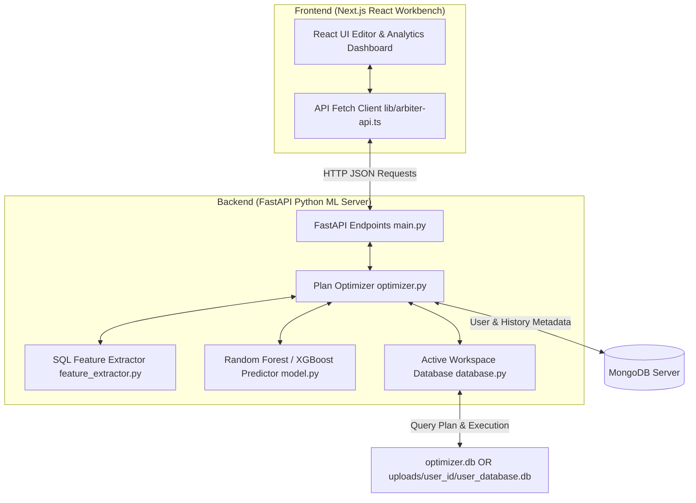

# Arbiter: Database Query Optimizer

Arbiter is a Machine Learning-assisted Database Query Optimizer project. It consists of a Next.js and Tailwind CSS frontend query workbench and a modular Python FastAPI backend. The backend acts as a cost estimator model to predict query execution latency based on structural features and SQLite EXPLAIN QUERY PLAN details, suggesting schema or syntax rewrites (Plan A vs Plan B) to optimize query performance.

---

## Monorepo Architecture

The following diagram illustrates the structural connection between the frontend workbench, the backend machine learning cost engine, and the separated execution and logging database paths:



---

## Directory Structure

```
Arbiter/
├── frontend/             # Next.js React UI Workbench
│   ├── app/              # Router pages (Optimizer dashboard, login, signup)
│   ├── components/       # UI panels (charts, layout, comparison tools, tables)
│   ├── lib/              # API caller helper (lib/arbiter-api.ts)
│   ├── package.json      # Node.js dependencies and script configs
│   └── tsconfig.json     # TypeScript configuration
│
├── backend/              # Python FastAPI ML Engine
│   ├── main.py           # API endpoints (execute, optimize, stats, logs, auth)
│   ├── database.py       # isolated SQLite connection & MongoDB mapping helpers
│   ├── feature_extractor.py # SQL parsing and 14-feature extraction
│   ├── model.py          # Machine learning model training (LR vs RF vs XGBoost)
│   ├── optimizer.py      # Rewrite evaluations (Index, Limit, Subquery)
│   ├── data_generator.py # Multi-scale profiling dataset generator (600 runs)
│   ├── test_robust_queries.py # Comprehensive test queries verification script
│   ├── test_integration.py # E2E API endpoints validator script
│   ├── requirements.txt  # Python package requirements (pyjwt, pymongo, xgboost, etc.)
│   ├── uploads/          # User isolated database file workspace directories
│   └── .gitignore        # Caches and runtime environment exclusions
│
├── .gitignore            # Root git ignore config
└── README.md             # Project master documentation (this file)
```

---

## Setup and Startup Guide

To run the complete monorepo application, start both the backend server and the frontend server.

### Prerequisites
- Node.js (v18+)
- Python (v3.8+)
- MongoDB listening locally at `mongodb://localhost:27017`

### 1. Backend Setup (FastAPI ML Server)
Open a terminal in the `backend` directory:

```bash
# Setup virtual environment and activate it
python -m venv .venv
.venv\Scripts\activate

# Install dependencies (including pyjwt, pymongo, and xgboost)
pip install -r requirements.txt

# Populate synthetic databases (Small, Medium, Large) and profile queries
python data_generator.py

# Train models (Linear Regression baseline, Random Forest, XGBoost) and evaluate splits
python model.py

# Run robust test queries to verify query planner & latency prediction accuracy
python test_robust_queries.py

# Start the API server on localhost:8000
python main.py
```

### 2. Frontend Setup (Next.js React UI)
Open a separate terminal in the `frontend` directory:

```bash
# Install package dependencies
npm install

# Start the frontend dev server on localhost:3000
npm run dev
```

Visit `http://localhost:3000` in your browser to access the Arbiter Query Optimizer Workbench.

---

## How it Works

### 1. SQL Feature Extraction (14 Features)
For any incoming query, we extract the following structural and estimated features:
* **Table/Join Metrics**: `num_tables`, `has_join`, `join_count`
* **Filter/Sort Metrics**: `num_conditions`, `has_order_by`, `sort_columns_count`, `has_limit`, `limit_val`
* **Aggregation/Complexity Metrics**: `has_group_by`, `aggregation_count`, `nested_subquery_count`
* **Explain Plan Estimates**: `scan_cost_estimate`, `table_sizes`, `index_usage_count` (heuristics parsed from SQLite's `EXPLAIN QUERY PLAN` detail logs)

### 2. Multi-Scale Database Profiling
Database performance scales with table size. To teach the model scaling behavior, `data_generator.py` generates and profiles queries across three databases:
* **Small (0.2x scale)**: ~4,000 order items
* **Medium (1.0x scale)**: ~50,000 order items (Saved as the default `optimizer.db` demo schema)
* **Large (2.5x scale)**: ~125,000 order items

### 3. Preventing Train-Test Leakage via Template Split
Splitting SQL profiling records randomly can lead to extreme leakage because parameters change (e.g., `age = 20` vs `age = 25`) while the query structure remains identical. The model easily memorizes query templates and overfits.

To ensure true structural generalization, Arbiter performs a **Template Split**:
* **Train Set**: We train only on templates 1 to 32.
* **Test Set**: We test exclusively on templates 33 to 40.
This measures the model's accuracy on completely unseen query structures (like CTEs or self-joins that it did not see during training) and proves whether the models learn from features instead of memorizing template patterns.

### 4. Machine Learning Model Comparison (Why XGBoost?)
We train and evaluate three regressor models under both **Random Split** (in-distribution validation) and **Template Split** (unseen generalization) validations:

1. **Linear Regression (Baseline)**: Too simplistic. Query latency is highly non-linear (e.g. joins have quadratic complexity, scans scale linearly with table size). Linear models fail to capture these step-function changes and interaction effects.
2. **Random Forest Regressor (Active Model)**: Fits independent decision trees in parallel. It is robust to overfitting and handles high-cardinality features well. However, it cannot extrapolate beyond the range of training labels.
3. **XGBoost Regressor (Extreme Gradient Boosting)**: Fits trees sequentially, where each new tree corrects the errors (residuals) of the previous ones. 
   * **Why XGBoost?**: Query latencies are heavily skewed (95% execute in under 2ms, while heavy correlated queries take 15,000ms+). XGBoost's sequential boosting minimizes residual errors more effectively than Random Forest, and its built-in L1/L2 regularization prevents overfitting to outlier queries.

### 5. Execution Plan Alternatives (Plan A vs Plan B)
The optimizer evaluates the original plan against proposed optimizations:
* **Subquery to JOIN**: Rewrites slow `IN (SELECT ...)` subqueries on large tables into explicit `INNER JOIN` queries.
* **Index Suggestion**: Suggests creating a database index. To verify its effect, the system starts a transaction, creates the index temporarily, runs `EXPLAIN QUERY PLAN` to capture the updated features, predicts the cost, and then rolls back the transaction.
* **Limit Suggestion**: Suggests appending a LIMIT 100 clause (safely guarded against aggregation and grouping queries).

The lower-cost plan is recommended and executed. Statistics (latency, feature profiles, and model error margins) are returned to the React frontend dashboard and logged to the `query_logs` collection in MongoDB.

### 6. Dynamic Workspace Ingestion & Security
* **Guest Preview Access**: Guest users (free tier) are locked to the default E-Commerce demo database (`optimizer.db`) for all queries, optimizations, and schema browsing. Database uploading is disabled and blocked for guests.
* **Logged-In User Access**: Logged-in users authenticate via secure JSON Web Tokens (JWT) and are permitted to upload custom SQLite databases (`.db`, `.sqlite`).
* **Multi-User Sandbox Isolation**: Custom database files are saved in unique user-specific directory paths (`uploads/{user_id}/user_database.db`). User mappings are stored in MongoDB, isolating queries and schema browsers per session.
* **MongoDB Analytics Logging**: Query execution statistics and performance metrics are logged inside a shared MongoDB collection namespaced by the authenticated user's ID, ensuring private query history views.
