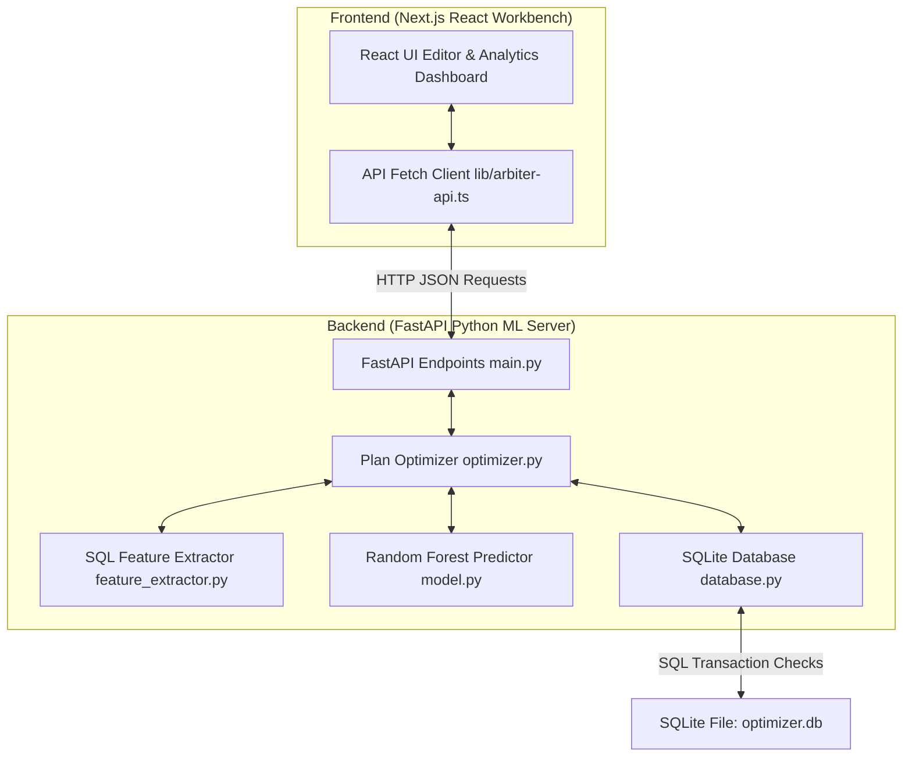

# Arbiter: Database Query Optimizer

Arbiter is a Machine Learning-assisted Database Query Optimizer project. It consists of a React-based Next.js frontend query workbench and a modular Python FastAPI backend. The backend acts as a cost estimator model to predict query execution latency based on structural features and SQLite EXPLAIN QUERY PLAN details, suggesting schema or syntax rewrites (Plan A vs Plan B) to optimize query performance.

---

## Monorepo Architecture

The following diagram illustrates the structural connection between the frontend workbench and the backend machine learning cost engine:



---

## Directory Structure

```
Arbiter/
├── frontend/             # Next.js React UI Workbench
│   ├── app/              # Router pages (Optimizer dashboard, login)
│   ├── components/       # UI panels (charts, layout, comparison tools)
│   ├── lib/              # API caller helper (lib/arbiter-api.ts)
│   ├── package.json      # Node.js dependencies and script configs
│   └── tsconfig.json     # TypeScript configuration
│
├── backend/              # Python FastAPI ML Engine
│   ├── main.py           # API endpoints (execute, optimize, stats, logs)
│   ├── database.py       # SQLite connection and query_logs configuration
│   ├── feature_extractor.py # SQL parsing and heuristic row estimation
│   ├── model.py          # Machine learning model training and prediction
│   ├── optimizer.py      # Rewrite evaluations (Index, Limit, Subquery)
│   ├── data_generator.py # Profiling dataset generation (57K rows, 600 runs)
│   ├── requirements.txt  # Python package requirements
│   └── .gitignore        # Caches and runtime environment exclusions
│
├── .gitignore            # Root git ignore config
└── README.md             # Project master documentation (this file)
```

---

## Setup and Startup Guide

To run the complete monorepo application, start both the backend server and the frontend server.

### 1. Backend Setup (FastAPI ML Server)
Open a terminal in the `backend` directory:

```bash
# Install dependencies
pip install -r requirements.txt

# Populate synthetic database (users, products, orders, order_items) and profile queries
python data_generator.py

# Train Random Forest cost estimation models
python model.py

# Start the API server on localhost:8000
python main.py
```

### 2. Frontend Setup (Next.js React UI)
Open a separate terminal in the `frontend` directory:

```bash
# Install package dependencies
npm install

# Start the frontend dev server on localhost:3000
npm run dev
```

Visit `http://localhost:3000` in your browser to access the Arbiter Query Optimizer Workbench.

---

## How it Works

### 1. SQL Feature Extraction
When a user submits a SELECT query:
*   The system extracts structural text features: number of tables, conditions (WHERE/ON filters), joins, limit status, sort columns, and grouping categories.
*   The system executes `EXPLAIN QUERY PLAN` on SQLite and parses the step nodes (SCAN, SEARCH USING INDEX, etc.).
*   It calculates a `scan_cost_estimate` based on cached table row counts: full SCAN counts as the full table size, INDEX search counts as 5% of table size, and integer Primary Key search counts as 1.

### 2. Machine Learning Predictions
*   The extracted features are evaluated using a Random Forest Regressor trained on the synthetic dataset (MAE = 2.77 ms, R2 = 0.93).
*   The system measures prediction confidence by calculating the standard deviation of prediction values across all 100 individual decision tree estimators in the Random Forest.

### 3. Execution Plan Alternatives (Plan A vs Plan B)
The optimizer evaluates the original plan against proposed optimizations:
*   **Subquery to JOIN**: Rewrites slow `IN (SELECT ...)` subqueries on large tables into explicit `INNER JOIN` queries.
*   **Index Suggestion**: Suggests creating a database index. To verify its effect, the system starts a transaction, creates the index temporarily, runs `EXPLAIN QUERY PLAN` to capture the updated features, predicts the cost, and then rolls back the transaction.
*   **Limit Suggestion**: Suggests appending a LIMIT 100 clause (safely guarded against aggregation and grouping queries).

The lower-cost plan is recommended and executed. Statistics (latency, feature profiles, and model error margins) are returned to the React frontend dashboard and logged to the `query_logs` SQLite table.
