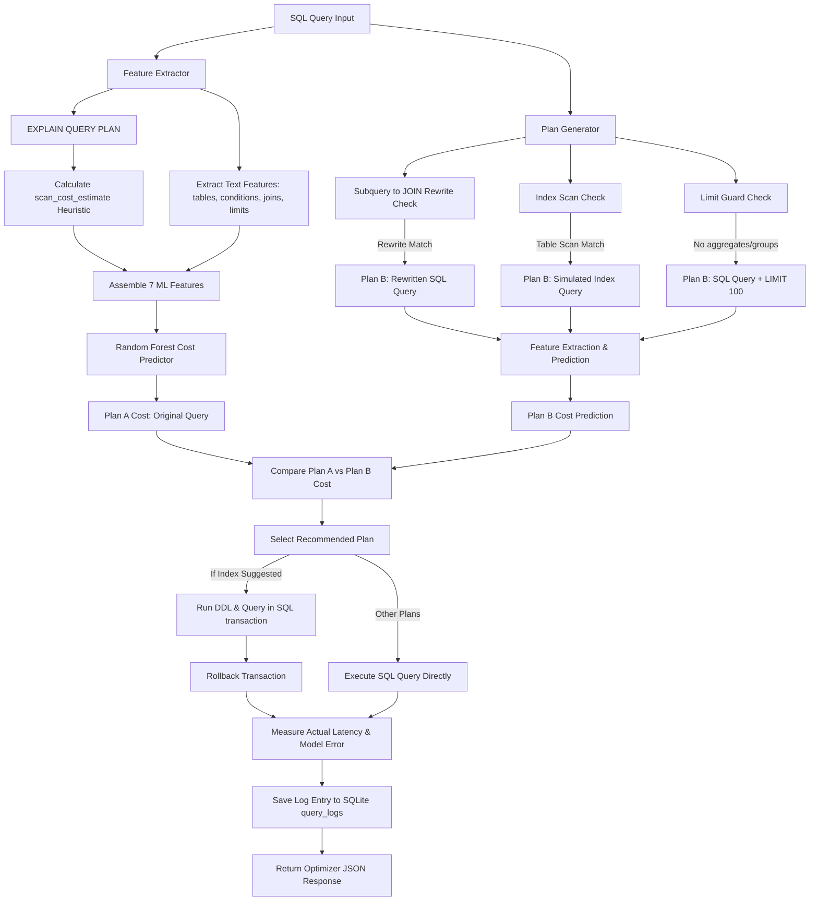

# Arbiter: Database Query Optimizer Cost Estimator Backend

Arbiter is a Machine Learning-assisted DB Query Optimizer backend. Using a Python FastAPI server, SQLite, and scikit-learn, it acts as a cost estimator to predict query execution latency based on structural features. It suggests optimizations, such as appending LIMIT clauses, creating composite database indexes, or restructuring subqueries to joins, and uses real-time query profiling and transactional validation to recommend the best execution plan.

---

## System Architecture

The following diagram illustrates the flow of a SQL query through the optimizer engine:



---

## Directory Layout

```
backend/
├── main.py                  # FastAPI app & endpoints
├── database.py              # SQLite connection helper & query_logs setup
├── feature_extractor.py     # SQL parsing & EXPLAIN QUERY PLAN analysis
├── model.py                 # Training, prediction, stats & retraining logic
├── optimizer.py             # Plan rewrite suggestions (Index, Limit & Subquery)
├── data_generator.py        # Synthetic database population & query profiling script
├── training_data.csv        # Generated query latency dataset (600 profiles)
├── cost_model.pkl           # Saved trained Random Forest model
├── requirements.txt         # Python dependencies
├── .gitignore               # Ignored python build files
├── test_integration.py      # E2E integration test script
├── test_only_requests.py    # Request validator script
└── README.md                # System documentation
```

---

## Installation and Setup

### Prerequisites
- Python 3.8 or higher
- SQLite3 (standard library)

### 1. Install Dependencies
Navigate to the `backend` folder and install the required libraries:
```bash
pip install -r requirements.txt
```

### 2. Generate Synthetic Dataset and Profile Latencies
Run the data generator to create a database with over 57,000 sample records (users, products, orders, order_items) and execute 600 queries to measure execution latency and save features to `training_data.csv`:
```bash
python data_generator.py
```

### 3. Train the Cost Estimator Models
Run the training script to compare Linear Regression (baseline) and Random Forest Regressor (main model), and save the trained model to `cost_model.pkl`:
```bash
python model.py
```

### 4. Start the FastAPI Server
Launch the backend server using uvicorn:
```bash
python main.py
```
The server will start at `http://127.0.0.1:8000`.

---

## Machine Learning Cost Estimation Approach

### Feature Extraction (7 Features)
For any incoming query, we extract the following structural and estimated features:
1. `num_tables` (int): Total number of tables involved in the query.
2. `num_conditions` (int): Number of comparison operators (=, >, <, LIKE, etc.) and connectors (AND, OR) in the filters.
3. `has_join` (0/1): Check if the query contains table joins.
4. `has_group_by` (0/1): Check if the query contains a GROUP BY clause.
5. `has_order_by` (0/1): Check if the query contains an ORDER BY clause.
6. `has_limit` (0/1): Check if the query limits returned rows.
7. `scan_cost_estimate` (float): A heuristic estimating the number of rows scanned by SQLite during execution.

### Limitation of scan_cost_estimate
SQLite's EXPLAIN QUERY PLAN command does not natively provide estimated row cardinality (unlike PostgreSQL or MySQL's query plan estimates). 

To bypass this, Arbiter queries the actual row counts of the tables in the database (caching them for performance) and applies the following heuristic based on the explain plan details:
- **Full SCAN**: If the detail starts with `SCAN table_name`, it scans all rows. Cost = table_size.
- **Primary Key SEARCH**: If it says `SEARCH ... USING INTEGER PRIMARY KEY`, it is a point lookup. Cost = 1.
- **Index SEARCH**: If it says `SEARCH ... USING INDEX` or `USING COVERING INDEX`, it is an index lookup. Cost = `max(1.0, 0.05 * table_size)` (assuming an index search scans roughly 5% of rows).
- **Temp Tables**: If it says `USE TEMP B-TREE`, we add a routing penalty of 500 rows.
- **LIMIT Capping**: If a LIMIT L is present (without group by or order by), the estimate is capped at L.

### Confidence Score Model
The confidence label returned with predictions ("High", "Medium", or "Low") is derived from the variance of the Random Forest model. 
Since a Random Forest is an ensemble of 100 independent decision trees, we pass the query features through all 100 trees and compute the standard deviation of their individual predictions:
- **Low Standard Deviation (< 2.0 ms)**: Trees strongly agree. Confidence is High.
- **Moderate Standard Deviation (2.0 ms - 8.0 ms)**: Moderate tree disagreement. Confidence is Medium.
- **High Standard Deviation (> 8.0 ms)**: High tree disagreement (unfamiliar feature space). Confidence is Low.

---

## Query Optimizer Logic (Plan A vs Plan B)

When a query is optimized, the engine evaluates Plan A (Original) and looks for Plan B (Optimized) rewrites:
1. **Subquery to JOIN Rewrite**: Checks if the query contains `WHERE col IN (SELECT col2 FROM table2)`. If matched, it restructures it to a `JOIN` with a `DISTINCT` keyword. This avoids nested subquery evaluation loops.
2. **Index Suggestion**: If the explain plan shows a SCAN on a table and there's a filter condition on a column, we suggest creating an index. To predict the cost, we temporarily run `CREATE INDEX` inside a database transaction, run `EXPLAIN QUERY PLAN` to featurize the changes, predict the cost, and then run `ROLLBACK` to discard the index.
3. **Limit Suggestion**: If the query does not limit rows, we suggest appending LIMIT 100 (guarded to ensure no GROUP BY or aggregates exist, as that would invalidate the aggregation results).

The plan with the lower predicted cost is recommended. If the recommended plan is Plan B with a suggested index, we run the index DDL and query inside a transaction, measure the actual execution latency, and rollback. This gives the user actual latency metrics without altering the database schema.

---

## Sample API Calls (curl)

### 1. Execute SQL Query
Runs the query and returns row records and execution stats.
```bash
curl -X POST http://127.0.0.1:8000/query/execute \
     -H "Content-Type: application/json" \
     -d '{"sql": "SELECT name, age, country FROM users WHERE age > 60 LIMIT 5;"}'
```

### 2. Optimize Query
Featurizes original query vs rewritten suggestions, runs ML estimations, executes the winner, and returns comparative stats.
```bash
curl -X POST http://127.0.0.1:8000/query/optimize \
     -H "Content-Type: application/json" \
     -d '{"sql": "SELECT * FROM users WHERE age = 30;"}'
```

### 3. Model Stats
Fetches current model type, training size, MAE, R², and feature importances.
```bash
curl -X GET http://127.0.0.1:8000/model/stats
```

### 4. Query Optimizer History
Lists the last 100 optimized queries showing features, predictions, and actual latency.
```bash
curl -X GET http://127.0.0.1:8000/query/history
```

### 5. Trigger Retrain
Triggers model retraining on combined baseline data and database logs (requires at least 100 log entries).
```bash
curl -X POST http://127.0.0.1:8000/model/retrain
```
