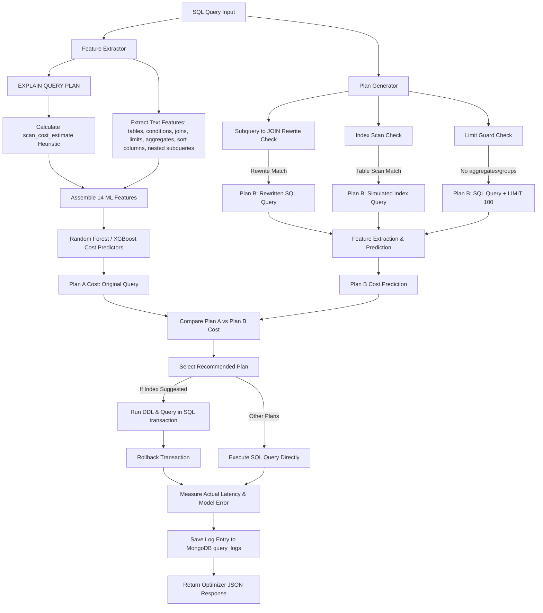

# Arbiter: Database Query Optimizer Cost Estimator Backend

Arbiter is a Machine Learning-assisted DB Query Optimizer backend. Using a Python FastAPI server, SQLite, MongoDB, and scikit-learn/XGBoost, it acts as a cost estimator to predict query execution latency based on structural features. It suggests optimizations, such as appending LIMIT clauses, creating composite database indexes, or restructuring subqueries to joins, and uses real-time query profiling and transactional validation to recommend the best execution plan.

---

## System Architecture

The following diagram illustrates the flow of a SQL query through the optimizer engine:



---

## Directory Layout

```
backend/
├── main.py                  # FastAPI app & endpoints
├── database.py              # MongoDB query_logs & isolated SQLite database mapping
├── feature_extractor.py     # SQL parsing & EXPLAIN QUERY PLAN analysis (14 features)
├── model.py                 # Training, prediction, stats & retraining (LR vs RF vs XGBoost)
├── optimizer.py             # Plan rewrite suggestions (Index, Limit & Subquery)
├── data_generator.py        # Multi-scale database generation & query profiling script
├── training_data.csv        # Generated query latency dataset (600 profiles across scales)
├── cost_model.pkl           # Saved trained Random Forest model with comparative metadata
├── requirements.txt         # Python dependencies (fastapi, pyjwt, pymongo, xgboost, etc.)
├── .gitignore               # Ignored python build files
├── test_integration.py      # E2E integration test script
└── README.md                # System documentation
```

---

## Installation and Setup

### Prerequisites
- Python 3.8 or higher
- MongoDB service listening locally at `mongodb://localhost:27017`
- SQLite3 (standard library)

### 1. Install Dependencies
Navigate to the `backend` folder and install the required libraries:
```bash
pip install -r requirements.txt
```

### 2. Generate Synthetic Dataset and Profile Latencies
Run the data generator to create three database scales (Small: 0.2x, Medium: 1.0x, Large: 2.5x) and execute 5 variations of 40 diverse templates on each (600 query profiles total) to capture execution latencies and save them to `training_data.csv`:
```bash
python data_generator.py
```

### 3. Train the Cost Estimator Models
Run the training script to compare Linear Regression (baseline), Random Forest Regressor (main model), and XGBoost (boosting candidate) under both Random Split and Template Split validations, and save the trained active model to `cost_model.pkl`:
```bash
python model.py
```

### 4. Start the FastAPI Server
Launch the backend server using uvicorn:
```bash
python main.py
```
The server will start at `http://127.0.0.1:8000`.

---

## Machine Learning Cost Estimation Approach

### Feature Extraction (14 Advanced Features)
For any incoming query, we extract the following structural and query-planner features:
1. `num_tables` (int): Total number of tables involved.
2. `num_conditions` (int): Number of comparison operators (=, >, <, LIKE, etc.) and connectors in the filters.
3. `has_join` (0/1): Check if the query contains table joins.
4. `join_count` (int): Number of joins in the query.
5. `has_group_by` (0/1): Check if the query contains a GROUP BY clause.
6. `has_order_by` (0/1): Check if the query contains an ORDER BY clause.
7. `has_limit` (0/1): Check if the query limits returned rows.
8. `limit_val` (float): Numeric value of LIMIT, defaulting to a large number representing unlimited.
9. `scan_cost_estimate` (float): A heuristic estimating the number of rows scanned by SQLite during execution.
10. `table_sizes` (float): Sum of rows of all scanned tables.
11. `index_usage_count` (int): Number of index lookups performed in the execution plan.
12. `aggregation_count` (int): Number of aggregate functions (SUM, COUNT, etc.) used.
13. `sort_columns_count` (int): Number of columns in the ORDER BY clause.
14. `nested_subquery_count` (int): Number of nested SELECT subqueries.

### Preventing Train-Test Leakage via Template Split
Splitting SQL profiling records randomly can lead to extreme leakage because parameters change (e.g. `age = 20` vs `age = 25`) while the query structure remains identical. The model easily memorizes query templates and overfits.

To ensure true structural generalization, Arbiter performs a **Template Split**:
- **Train Set**: We train only on templates 1 to 32.
- **Test Set**: We test exclusively on templates 33 to 40.
This measures the model's accuracy on completely unseen query structures (like CTEs or self-joins that it did not see during training) and proves whether the models learn from features (like `index_usage_count` and `nested_subquery_count`) instead of memorizing template patterns.

---

## Sample API Calls (curl)

### 1. Execute SQL Query
```bash
curl -X POST http://127.0.0.1:8000/query/execute \
     -H "Content-Type: application/json" \
     -d '{"sql": "SELECT name, age, country FROM users WHERE age > 60 LIMIT 5;"}'
```

### 2. Optimize Query
```bash
curl -X POST http://127.0.0.1:8000/query/optimize \
     -H "Content-Type: application/json" \
     -d '{"sql": "SELECT * FROM users WHERE age = 30;"}'
```

### 3. Model Stats
Fetches current active model type, training size, MAE, R², and comparative stats.
```bash
curl -X GET http://127.0.0.1:8000/model/stats
```
